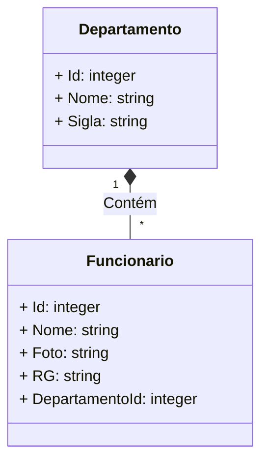

Desafio EvoSystems - Desenvolvimento Web Full-Stack

Este repositório contém o código-fonte de um Desafio para criar uma aplicação web full-stack usando Angular no frontend e ASP.NET Core 7 no backend, focado no gerenciamento de departamentos.

# Recursos Principais:

    Desenvolvimento web full-stack.
    Utilização do Angular no frontend.
    Utilização do ASP.NET Core 7 no backend.

## Diagrama de Classes (Domínio da API)

# Em Angular

A aplicação possui uma tela para listar departamentos, com opções de cadastrar, editar e deletar. Ao selecionar um departamento, é redirecionado para uma lista de funcionários desse departamento, onde deve haver opções para cadastrar, editar e deletar um funcionário.

